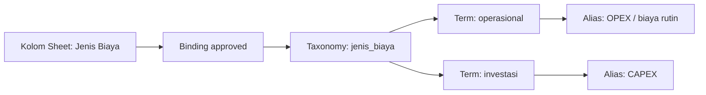
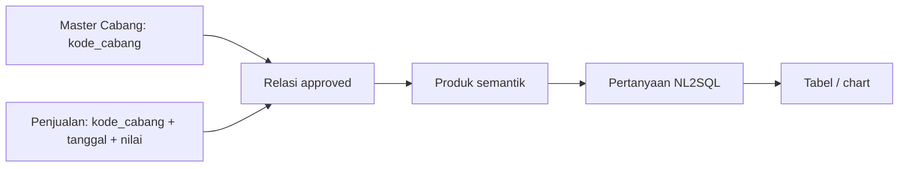

# Contoh pengisian Google Sheet AI

Contoh di bawah memakai data fiktif. Gunakan nama dan klasifikasi resmi organisasi saat mengisi
aplikasi. Kode bisnis dibuat pengguna ketika form memintanya; UUID internal dibuat oleh sistem.
Contoh ini juga menjadi sumber artikel knowledge base agar tombol **Tanya AI** dapat menjawab
pertanyaan seperti “apa isi taxonomy?”, “yurisdiksi diisi apa?”, atau “contoh master cabang”.

## 1. Taxonomy dan term

Di **Registry taxonomy**, isi **Kode** `jenis_biaya` dan **Nama** `Jenis Biaya`. Tambahkan term:

| Kode term | Label | Parent | Alias, satu per baris |
|---|---|---|---|
| `operasional` | Biaya Operasional | Root | `OPEX`, `biaya rutin` |
| `investasi` | Biaya Investasi | Root | `CAPEX` |

Kode taxonomy dan term diawali huruf kecil, lalu huruf kecil, angka, atau `_`, maksimal 63
karakter. Kode dan label term wajib; parent dan alias opsional. Reviewer menyetujui taxonomy
sebelum digunakan. Pada **Binding kolom taxonomy**, pilih header sumber `Jenis Biaya`, taxonomy
`jenis_biaya` yang approved, normalisasi `TRIM_CASEFOLD`, dan centang **Nilai wajib ada pada
taxonomy** bila nilai kosong/asing harus ditahan. Simpan dan minta persetujuan binding.

## 2. Atribut organisasi dan akses

Admin membuat contoh berikut pada **Administrasi → Atribut akses**. Pilih Jenis, isi Kode dan
Label, lalu pilih Parent bila memang ada hierarki sejenis.

| Jenis | Kode | Label | Makna |
|---|---|---|---|
| DEPARTMENT | `keuangan` | Departemen Keuangan | Unit pemilik atau unit pengguna |
| BUSINESS_DOMAIN | `penjualan` | Penjualan | Ranah/proses bisnis |
| JURISDICTION | `jatim` | Jawa Timur | Cakupan wilayah atau entitas bisnis |
| CLEARANCE | `internal` | Internal | Kelayakan akses pengguna |
| PURPOSE | `analitik_manajemen` | Analitik Manajemen | Tujuan penggunaan data |

Kode atribut unik untuk pasangan tenant dan jenis atribut, maksimal 80 karakter, dan boleh memakai huruf, angka, `.`, `_`, atau `-`. Label
maksimal 200 karakter. Parent tidak memberi izin turunan otomatis. `CLEARANCE` adalah atribut
akses pengguna; **Sensitivitas** pada sumber adalah klasifikasi data `LOW`/`MEDIUM`/`HIGH`.
Role, assignment, dan policy harus cocok agar akses benar-benar berlaku.

## 3. Pendaftaran Google Sheet

Pada **Workspace ETL → Hubungkan Google Sheet baru**, contoh pengisian:

| Isian | Contoh |
|---|---|
| Nama sumber | Penjualan Cabang Jawa Timur |
| URL spreadsheet | URL Google Sheet asli yang sudah dibagikan ke service account sebagai Viewer |
| Deskripsi | Transaksi penjualan harian per cabang untuk analisis bulanan. |
| Jadwal otomatis | Tanpa jadwal, sampai pemilik memastikan frekuensi pembaruan |
| Unit pemilik | Departemen Keuangan |
| Domain bisnis | Penjualan |
| Yurisdiksi | Jawa Timur |
| Purpose | Analitik Manajemen |
| Data owner | Akun pemilik bisnis pada dropdown |
| Data steward | Akun pengelola data pada dropdown |
| Sensitivitas | LOW hanya jika benar menurut klasifikasi organisasi |

Pilihan atribut dan akun diambil dari tenant/assignment aktif. Kode sumber, UUID, dan alias
kredensial ditentukan otomatis oleh form. Jika pilihan belum ada, admin perlu menyiapkan
atribut/assignment yang sesuai. Setelah koneksi dan profiling berhasil, klasifikasikan **setiap
tab** sebagai MASTER atau NON_MASTER.

## 4. Master, fakta, dan dashboard

Contoh master **Cabang**: kode registry `cabang`, nama `Master Cabang`, field
`kode_cabang` (teks, wajib) sebagai business key, `nama_cabang` (teks) sebagai label,
serta `wilayah` bila tersedia. Tab **Penjualan** adalah NON_MASTER dan dapat berisi
`tanggal`, `kode_cabang`, `nomor_transaksi`, `nilai_penjualan`. Binding yang disetujui
menghubungkan `kode_cabang` transaksi ke master Cabang. Kode yang tidak dikenal perlu
ditinjau pada batch, bukan diasumsikan cocok.

Setelah konfigurasi dan import disetujui, produk semantik dapat mempunyai dimensi
`tanggal`/`cabang` dan metrik `total_penjualan`. Contoh pertanyaan dashboard:
**“Tampilkan total penjualan per cabang bulan ini.”**

## Catatan pengisian

### Contoh akses multi-unit dan reviewer

Admin memilih akun `manajer.penjualan` dan mencentang `Penjualan Malang` serta
`Penjualan Surabaya` pada **Akses multi-unit**. Kedua unit harus terdaftar dan dipilih
satu per satu; unit induk tidak menambahkan unit turunannya secara otomatis. Untuk sumber
`Penjualan Malang`, admin menunjuk akun reviewer pada **Review metadata sumber**,
**Konfigurasi ETL**, dan **Batch import**. Tiap daftar bisa berisi orang yang berbeda.
Penunjukan reviewer tidak menggantikan policy akses data atau syarat reviewer terpisah.

Untuk sumber gabungan `Penjualan–Keuangan`, pada **Persetujuan sebelum data tayang**
pilih `approver.it` sebagai pemeriksa IT, tambahkan unit `Penjualan Malang` dengan
approver `manajer.penjualan`, dan unit `Keuangan Surabaya` dengan approver
`manajer.keuangan`. Kedua manajer harus mempunyai assignment aktif pada unitnya.
Setelah konfigurasi versi 2 approved, IT mencatat hasil uji skema/DQ/keamanan,
lalu masing-masing manajer mencatat kecocokan definisi bisnis. Status **siap deploy**
baru muncul setelah ketiganya menyetujui versi 2. Kode dan nama ini contoh fiktif;
admin memilih akun dan unit dari daftar aplikasi, bukan mengetik UUID.

- Contoh tidak membuat atribut atau taxonomy otomatis; admin/steward perlu menambahkannya pada tenant.
- Gunakan kode yang stabil serta jelas bagi organisasi. Hindari memakai nama yang mudah berubah sebagai business key.
- Pilih role, owner, steward, yurisdiksi, purpose, dan sensitivitas sesuai kebijakan resmi.
- Taxonomy approved dan binding approved diperlukan sebelum konfigurasi memakainya.
- Perubahan taxonomy terbit dilakukan melalui draft versi berikutnya dan approval ulang.

