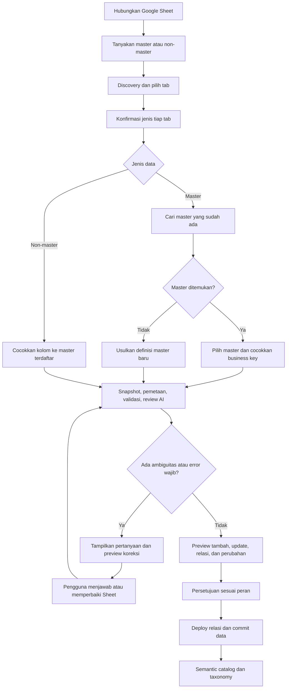

# Master data, referensi, dan validasi import

Status: **BE-01–BE-05 menyediakan kebijakan, klasifikasi, registry, binding, storage kanonis, dan batch review persisten**. Dokumen ini mencatat kebutuhan bisnis dari diskusi 8 September 2026. Pemuatan record, pertanyaan/jawaban per sel, dan review AI masih tahap lanjutan. Status mengikuti [TODO Backend](TODO_BACKEND.md); implementasi aktif dijelaskan di [BE-03](REGISTRY_MASTER_BE03.md), [BE-04](STORAGE_MASTER_BE04.md), dan [BE-05](IMPORT_REVIEW_BE05.md).

Tujuannya: menetapkan identitas master yang baku sebelum taxonomy/semantic layer, memperbarui master yang sama tanpa membuat duplikat, dan menahan data ambigu sampai pengguna menjawab pertanyaan sistem.

## 1. Kebutuhan bisnis

1. Saat pengguna menghubungkan Google Sheets, sistem menanyakan apakah data tersebut master atau non-master.
2. Untuk master, cari master yang sudah ada sebelum menawarkan pembuatan master baru. Jika sudah ada, arahkan import untuk memperbarui master tersebut.
3. Untuk non-master, periksa kolom yang merujuk product, customer, vendor, karyawan, UOM, jenjang penilaian, pangkat, struktur gaji, atau master lain yang terdaftar.
4. Relasi yang disetujui harus menjadi foreign key PostgreSQL, bukan hanya nama relasi dalam metadata atau teks prompt.
5. Pemeriksaan kualitas berjalan setiap import/sync. AI mengusulkan kesalahan penulisan, ketidakkonsistenan, dan kandidat padanan; keputusan ambigu menjadi pertanyaan bagi pengguna.
6. Data mentah dipertahankan. Koreksi harus dapat ditelusuri ke nilai asal, alasan, dan keputusan pengguna.
7. Konfigurasi yang masih memiliki pertanyaan wajib atau referensi tidak valid tidak boleh diterapkan ke data trusted.
8. Frontend Vue menjadi tempat memilih jenis data, memilih master, meninjau perubahan, dan menjawab pertanyaan.

### Keputusan klasifikasi dan insert (BE-01)

Pengguna sudah mengonfirmasi klasifikasi **per tab** dan **usulan penambahan kode baru yang wajib disetujui**. Kode yang cocok diperbarui menurut preview; record yang tidak muncul tetap disimpan sesuai policy awal. Detail sumber otoritatif, perubahan key, masa berlaku, apply atomik, dan kontrak versi tersedia di [Kebijakan data BE-01](KEBIJAKAN_DATA_BE01.md).

Kontrak dasar sudah tersedia; registry master, binding, dan penerapan policy ke import masih mengikuti tahapan [TODO Backend](TODO_BACKEND.md). Pilihan tersebut bukan izin untuk menggabungkan atau memigrasikan data production secara otomatis.

## 2. Master dan non-master bukan pembagian tipe kolom

Master adalah identitas/acuan yang digunakan berulang. Non-master adalah kejadian, pengukuran, atau fakta yang merujuk identitas tersebut. Master tetap dapat berisi angka, tanggal, berat, atau nominal; nilai seperti harga juga dapat mempunyai tabel referensi dan riwayat masa berlaku.

| Dataset | Klasifikasi awal | Identitas dan contoh relasi |
|---|---|---|
| Produk | Master | Kode produk; referensi UOM |
| Customer / vendor | Master | Kode pihak; nama bukan kunci tunggal |
| Karyawan | Master | Kode karyawan; referensi pangkat/jabatan |
| UOM | Master referensi | Kode satuan baku dan alias yang disetujui |
| Pangkat / jenjang penilaian | Master referensi | Kode, urutan, label |
| Struktur gaji | Master kebijakan dengan versi | Grade/pangkat dan periode berlaku |
| Penjualan | Non-master/transaksi | Nomor transaksi, produk, customer, kuantitas, harga pada transaksi |
| Hasil penilaian | Non-master/fakta | Karyawan, periode, jenis penilaian, hasil |
| Penimbangan | Non-master/pengukuran | Produk, waktu pengukuran, berat aktual, UOM |

Jangan menimpa histori transaksi hanya karena harga atau nama master terbaru berubah. Simpan nilai fakta pada waktu transaksi; untuk kebijakan bertanggal, simpan referensi versi atau masa berlaku. Konversi satuan juga memerlukan aturan eksplisit, bukan penggantian ejaan saja.

## 3. Kesenjangan implementasi saat ini

| Area | Kondisi kode sekarang | Perubahan yang diperlukan |
|---|---|---|
| Pendaftaran sumber | `SourceCreate` tetap menerima identitas sumber; tab baru meminta klasifikasi setelah discovery | Integrasi pertanyaan klasifikasi pada frontend |
| Tab | `SourceSheet` menyimpan jenis, status/revision klasifikasi, actor/time; API GET/PUT tersedia | Binding ke registry master approved |
| Target tabel | Nama tabel memakai suffix UUID tab | Target master bersama yang identitasnya tidak mengikuti file/tab |
| UPSERT | Business key berlaku pada tabel tab itu sendiri | UPSERT ke master kanonis lintas import/sumber dalam tenant |
| Relasi | Compiler belum membuat FK referensi master | Registry relasi yang ditinjau dan FK komposit tenant |
| Profiling | Sampel sel disamarkan sebelum konteks AI | Jalur review nilai yang terkontrol; tidak mengklaim AI sudah mengecek ejaan sel |
| Klarifikasi | Pertanyaan teks konfigurasi dan jawaban tersimpan pada `review_state` | Pertanyaan ber-ID per sel/batch, kandidat terkontrol, keputusan, dan evidence per import |
| Sync | Transformasi dan aturan kualitas deterministik | Pemeriksaan referensi + review AI sebelum commit setiap snapshot baru |
| Frontend | Login, workspace sumber, wizard review konfigurasi, preview Excel, dan approval tersedia | Klasifikasi tab, katalog master, preview perubahan record master, dan pertanyaan per import |

Backend sudah mempunyai fondasi yang dapat digunakan kembali: tenant scoping, snapshot, profiling, draft konfigurasi, approval terpisah, artifact versi, antrean job, dan staging/quarantine. Fondasi ini tetap dipakai.

## 4. Alur pengguna



Profiling boleh dilakukan untuk membantu klasifikasi. Deploy, approval final, dan penerapan data harus tertahan sampai klasifikasi serta pertanyaan wajib selesai. Ketika jadwal menemukan nilai ambigu, job masuk `NEEDS_INPUT`; sistem menampilkan tugas tindak lanjut, bukan mengarang jawaban untuk melanjutkan.

## 5. Identitas master dan aturan update

### Registry master

Registry metadata dan binding sudah diimplementasikan pada BE-03. Rincian di bawah tetap menjadi sasaran desain lengkap; target fisik record master dan migrasi key belum berjalan. Gunakan API Reference/BE-03 untuk nama field dan kontrak aktif, bukan menganggap seluruh field rancangan di sini sudah tersedia.

Usulan `platform.master_definition`:

- `id`, `tenant_id`, `code`, `name`, `description`, `status`, `revision_no`.
- Definisi business key, field label, daftar kolom bertipe, normalisasi yang diperbolehkan, alias dataset, serta aturan masa berlaku jika diperlukan.
- Referensi target fisik dan versi schema yang dikelola server; klien/AI tidak boleh mengirim SQL atau nama tabel bebas untuk dieksekusi.
- Unique constraint `(tenant_id, code)`; scope master baku awal adalah per tenant. Master bersama lintas tenant memerlukan desain akses tersendiri.

Usulan `platform.master_source_binding` menghubungkan tab ke master yang sama. Satu master dapat menerima beberapa sumber yang telah disetujui. Tentukan sumber otoritatif atau aturan konflik; sumber terakhir tidak otomatis dianggap paling benar.

### Record kanonis

Setiap master mempunyai tabel typed di schema `trusted`, dengan nama yang diturunkan dari ID master oleh server. Identitas tabel tetap sama walaupun URL Sheet, nama tab, atau file sumber berubah.

- `_tenant_id` dan `_master_id` (UUID record stabil).
- Business key seperti `product_code` atau `(vendor_code, branch_code)` yang wajib terisi.
- Kolom bisnis bertipe, status aktif, revision, dan metadata asal/perubahan.
- `UNIQUE (_tenant_id, _master_id)` untuk target FK.
- `UNIQUE (_tenant_id, <business key>)` untuk mencegah duplikat, termasuk saat dua import berjalan bersamaan.

Business key master bukan nama tampilan. Perubahan nama tidak mengganti UUID record. Perubahan business key memerlukan proses khusus yang disetujui dan alias/mapping migrasi; jangan memperlakukannya sebagai record baru tanpa konfirmasi.

### Preview import master

| Kondisi | Tindakan |
|---|---|
| Business key sama, nilai sama | `UNCHANGED` |
| Business key sama, atribut berubah | `UPDATE`, tampilkan before/after |
| Business key belum ada | `INSERT_PROPOSED`, sesuai kebijakan penambahan yang dikonfirmasi |
| Kode kosong atau duplikat di Sheet | Pertanyaan/error; jangan memilih salah satu baris |
| Nama mirip tetapi kode berbeda | Kandidat kemungkinan duplikat; minta keputusan |
| Record lama tidak muncul di Sheet baru | Tetap disimpan; tidak dihapus otomatis |
| Perubahan bertabrakan dengan import lain | Revalidasi revision, tampilkan konflik |

Master tidak menggunakan `FULL_REFRESH` yang menghapus record yang mungkin masih dirujuk transaksi. Penonaktifan record dilakukan eksplisit; penghapusan harus ditolak jika masih direferensikan. Import ulang snapshot yang sama tidak boleh menghasilkan record atau keputusan ganda.

## 6. Pencocokan referensi non-master

Pemeriksaan mempunyai dua tingkat:

1. **Tingkat kolom:** apakah `Produk`, `SKU`, atau `Kode Barang` merujuk Master Product? AI boleh menyarankan dari metadata dan katalog tenant, lalu pengguna mengonfirmasi binding.
2. **Tingkat nilai:** record master mana yang dirujuk oleh nilai sel pada kolom tersebut?

Urutan resolusi nilai:

1. Business key tepat setelah normalisasi yang telah disetujui.
2. Alias eksplisit dalam master/kolom/tenant yang sama, dengan satu target aktif.
3. Kandidat kemiripan ejaan dari pencarian deterministik dan AI sebagai bantuan review.
4. Tidak ada atau lebih dari satu target masuk akal: pertanyaan wajib.

Confidence AI bukan izin otomatis untuk menggabungkan dua customer, karyawan, atau produk. Jangan mengubah leading zero pada kode. `KG` dan `kg` mungkin satu alias, tetapi `kg` dan `g` memerlukan faktor konversi; produk kemasan berbeda juga tidak boleh digabung hanya karena nama mirip.

Untuk referensi yang belum ditemukan, pilihan pengguna adalah memilih master yang benar, mengusulkan record master baru melalui approval, memperbaiki sumber, atau membatalkan import. Nilai kosong hanya boleh diterima jika relasi memang opsional.

### Foreign key PostgreSQL

Transaksi menyimpan UUID master teresolusi, sedangkan nilai asal tetap tersedia di snapshot/staging dan audit. Contoh DDL konseptual, bukan perintah untuk database saat ini:

```sql
FOREIGN KEY (_tenant_id, product_id)
    REFERENCES trusted.master_product (_tenant_id, _master_id)
    ON DELETE RESTRICT
```

Nama tabel sebenarnya dibuat compiler dari registry. Relasi harus berasal dari registry yang tenant-nya sama, approved, dan tipe kolomnya cocok. Role DDL memerlukan `REFERENCES` pada tabel master jika master dimiliki role lain, serta akses baca yang sesuai. Role reader tetap SELECT-only pada semantic view.

Master yang dirujuk harus sudah tersedia sebelum transaksi dimuat. Master yang saling merujuk diproses berdasarkan dependency; siklus harus dideteksi dan menjadi pekerjaan review, bukan retry tanpa akhir. Buat/validasi FK juga pada schema yang sudah ada lewat migrasi yang ditinjau.

Foreign key fisik tidak otomatis mengaktifkan join NL2SQL. Query builder saat ini satu data product tanpa join; penyajian label master memerlukan semantic view atau dukungan relationship terpisah yang tetap menjaga tenant dan row scope.

## 7. Review AI dan pertanyaan pengguna

### Cakupan pemeriksaan

Semua baris pada setiap snapshot baru melewati validasi deterministik: tipe, required, format, business key, duplikasi, aturan domain, referensi, dan konflik versi. Review AI digunakan untuk ejaan, makna, pemetaan, dan kandidat duplikat; AI dapat salah dan tidak menggantikan constraints database.

Kebutuhan “selalu dicek AI” berarti setiap import baru membutuhkan bukti review AI sesuai kebijakan field yang boleh diproses, bukan hanya saat schema berubah. Chunk seluruh cakupan yang diizinkan, simpan jumlah baris/nilai yang sudah dan belum diperiksa, serta jangan menganggap sampel sebagai pemeriksaan seluruh Sheet. Nilai unik boleh dideduplikasi untuk review, dengan bukti pemetaan kembali ke semua baris.

Implementasi sekarang menyamarkan semua sampel. Untuk review nilai, tambahkan kebijakan eksplisit: field sensitif seperti NIK, alamat, nama karyawan, dan nominal personal tidak otomatis dikirim ke penyedia AI. Validasi lokal tetap berjalan; temuan pada field yang tidak boleh dikirim diarahkan ke review pengguna atau mekanisme yang disetujui. UI harus menunjukkan cakupan pemeriksaan, bukan badge “semua diperiksa AI” yang tidak sesuai kenyataan.

Jika AI wajib tetapi gagal, budget habis, atau sebagian chunk belum selesai, import tetap tertahan. Tidak boleh dianggap bersih melalui fallback diam-diam.

### Bentuk pertanyaan terstruktur

Usulan `platform.import_question` menyimpan:

- Tenant, import batch, tab, snapshot hash, row/column, konfigurasi dan versi master yang diperiksa.
- Jenis masalah: `CLASSIFICATION_REQUIRED`, `MASTER_DUPLICATE_CANDIDATE`, `REFERENCE_NOT_FOUND`, `AMBIGUOUS_MATCH`, `TYPO_SUSPECTED`, `KEY_CONFLICT`, atau `SEMANTICS_UNCLEAR`.
- Nilai asli dan kandidat di storage berakses terbatas; respons API menyesuaikan hak akses pengguna.
- Pertanyaan bahasa Indonesia, pilihan jawaban terstruktur, alasan, evidence, dan confidence jika dari AI.
- Status, revision, keputusan, pengguna yang menjawab, waktu, serta audit before/after.

Contoh tampilan: “Baris 18, kolom Produk berisi ‘Susu Strabery’. Apakah yang dimaksud P001 — Susu Strawberry atau P018 — Susu Strawberry 250 ml?” Sistem tidak memilih sendiri karena dua produk berbeda.

Jawaban harus merujuk ID kandidat yang diizinkan server. Free text boleh menjadi penjelasan, tetapi tidak dieksekusi sebagai SQL, ekspresi transformasi, atau instruksi bebas. Pengguna dapat memilih `KEEP_ORIGINAL` untuk temuan ejaan yang ternyata benar, tetapi tidak bisa melewati FK wajib yang tidak valid.

### Keputusan dan revalidasi

Usulan `platform.import_decision` menyimpan koreksi untuk snapshot tertentu. Penerapannya dilakukan pada staging; nilai di Google Sheets tidak diubah tanpa fitur dan otorisasi terpisah.

Jika pengguna menyetujui alias yang boleh dipakai pada import berikutnya, simpan sebagai aturan terpisah dengan scope tenant/master/kolom. Jawaban satu baris tidak otomatis menjadi aturan global.

Perubahan nilai sumber, schema konfigurasi, versi master, aturan alias, atau model/prompt review membatalkan bukti review yang relevan. Saat pengguna menjawab pertanyaan lama, server memeriksa revision dan memberi konflik bila evidence sudah berubah.

Kunci idempotency/review mencakup tenant, tab, snapshot hash, versi konfigurasi, versi master yang dirujuk, dan versi kebijakan review. Ini mencegah hasil pemeriksaan lama melewatkan master yang baru berubah.

## 8. Status batch dan transaksi

Usulan status:

```text
DISCOVERED → CLASSIFICATION_REQUIRED → MAPPING_REQUIRED
→ VALIDATING → AI_REVIEWING → NEEDS_INPUT → VALIDATING
→ READY_FOR_APPROVAL → APPROVED → APPLYING → SUCCEEDED
```

Cabang kegagalan: `FAILED`, `CANCELLED`, dan `STALE_REVIEW`. Status menunggu pengguna tidak diperlakukan sebagai kegagalan teknis yang diulang worker terus-menerus.

Simpan snapshot, hasil review, dan pertanyaan sebelum job berhenti menunggu input. Jangan kehilangan pertanyaan karena seluruh transaction rollback. Terapkan data trusted hanya setelah keputusan lengkap, dengan lock dan pemeriksaan revision terbaru. Jika apply gagal, tidak boleh tersisa separuh update master/transaksi.

Default yang diusulkan adalah apply atomik per batch/tab. Karantina dan partial load hanya boleh diaktifkan sebagai kebijakan eksplisit; jangan menerapkannya pada import yang masih memiliki pertanyaan wajib.

Untuk preview master, simpan versi target saat preview dibuat. Sebelum commit, ulangi pemeriksaan konflik. Multi-source update ke master yang sama diserialisasi atau memakai optimistic concurrency; audit tetap menyimpan sumber setiap perubahan.

## 9. Kontrak API yang diusulkan

Endpoint klasifikasi tersedia pada BE-02, dan list/create definisi master tersedia pada BE-03. Endpoint record master dan import-review di bawah **masih usulan**. Lifecycle definisi serta binding menggunakan endpoint aktif yang didokumentasikan lengkap di [BE-03](REGISTRY_MASTER_BE03.md).

| Endpoint | Fungsi |
|---|---|
| `GET /master-definitions?search=...` | Aktif BE-03: cari master tenant, alias, dan metadata business key |
| `POST /master-definitions` | Aktif BE-03: usulkan definisi master; cek kandidat dan kode duplikat |
| `GET /master-definitions/{id}/records` | Cari record yang diizinkan untuk preview/resolusi |
| `GET /source-sheets/{id}/classification` | Aktif BE-02: jenis, status/revision, actor/time, dan blocker eksekusi |
| `PUT /source-sheets/{id}/classification` | Aktif BE-02: konfirmasi master/non-master dengan revision; binding master belum diterima |
| `POST /source-sheets/{id}/import-reviews` | Buat snapshot dan antrekan review baru |
| `GET /import-reviews/{id}` | Status, coverage, versi evidence, dan ringkasan perubahan |
| `GET /import-reviews/{id}/questions` | Pertanyaan terbuka dengan pagination |
| `POST /import-reviews/{id}/answers` | Simpan keputusan terstruktur dengan revision |
| `GET /import-reviews/{id}/preview` | Before/after, tambah/update/tetap/error, dan rencana relasi |
| `POST /import-reviews/{id}/approve` | Persetujuan ketika pertanyaan wajib sudah selesai |
| `POST /import-reviews/{id}/apply` | Antrekan apply yang idempotent dan terikat snapshot |

Path di atas relatif ke `/api/v1`. Lifecycle approval definisi master dan pengeditannya mengikuti pola draft/revision/approve konfigurasi yang sudah ada. Daftar record tidak boleh membuka data master sensitif kepada semua viewer.

Payload klasifikasi master yang aktif pada BE-02 (binding tersedia melalui endpoint terpisah BE-03):

```json
{
  "revision_no": 1,
  "dataset_kind": "MASTER"
}
```

Contoh jawaban pertanyaan:

```json
{
  "revision_no": 3,
  "answers": [
    {
      "question_id": "UUID_PERTANYAAN",
      "action": "SELECT_MASTER_RECORD",
      "master_record_id": "UUID_KANDIDAT_YANG_DIIZINKAN"
    }
  ]
}
```

UUID contoh adalah placeholder. Server harus menolak pertanyaan, master, kandidat, snapshot, atau revision yang tidak sesuai tenant dan batch. Endpoint apply langsung juga harus memeriksa gate yang sama, agar frontend bukan satu-satunya penjaga validitas.

## 10. Integrasi frontend Vue

Frontend berada di `C:/projek/vue-googlesheet-ai`. Login, workspace sumber (`/workspace`), dan wizard review konfigurasi (`/configurations/:id/review`) sudah tersedia dengan API nyata. Review Excel, jawaban pertanyaan konfigurasi, submit, approval, deploy, dan sync menggunakan endpoint backend. Form klasifikasi dapat dihubungkan ke API BE-02 yang kini tersedia; katalog master dan review record per batch masih menunggu API tahap berikutnya.

Perluasan layar untuk alur master/import:

1. **Sumber data:** masukkan URL, pertanyaan master/non-master, discovery, dan pilihan tab.
2. **Klasifikasi:** konfirmasi jenis tiap tab. Untuk master, pencarian master lama tampil sebelum tombol membuat master baru.
3. **Pemetaan:** pilih business key, field label, tipe data, serta referensi master per kolom. Tampilkan saran AI sebagai saran yang perlu ditinjau.
4. **Pemeriksaan data:** progres validasi/AI dan coverage; tampilkan error, bukan menandai sukses saat sebagian pemeriksaan gagal.
5. **Pertanyaan:** nilai asli, kandidat, alasan, jawaban, dan status; simpan progres agar dapat dilanjutkan setelah login kembali.
6. **Preview:** jumlah tambah/update/tetap dan before/after. Tampilkan referensi yang akan dibuat serta efek perubahan master.
7. **Persetujuan dan hasil:** approver terpisah, status apply, hasil sync, dan audit sumber.

Master memiliki halaman katalog dan detail tersendiri, tidak hanya modal saat upload. Tombol lanjut/approve/apply dinonaktifkan jika gate belum terpenuhi; backend tetap memeriksa gate tersebut secara mandiri. UI memakai bahasa bisnis, tanpa meminta pengguna mengetik SQL, FK, atau nama tabel fisik.

Konfigurasi frontend tetap hanya menunjuk API. OpenAI key, JSON Service Account, dan password database tetap di backend. Pembuatan UI harus memakai endpoint nyata; chart atau data contoh tidak menjadi bukti fitur sudah terhubung.

## 11. Urutan implementasi dan migrasi

1. Terapkan keputusan BE-01: klasifikasi per tab dan usulan insert wajib disetujui, sesuai kontrak policy versi 1.0.
2. Tambahkan registry master, binding sumber, klasifikasi, serta tabel import review/question/decision dan migration yang tenant-safe.
3. Bangun API katalog, klasifikasi, review, dan keputusan dengan optimistic concurrency, audit, dan role yang sesuai.
4. Ubah compiler agar master memakai target kanonis, serta buat FK terverifikasi untuk referensi. Uji grant role DDL dan role operasional.
5. Tambahkan preview UPSERT, conflict handling, alias terkontrol, dependency order, dan apply atomik.
6. Tambahkan review AI per snapshot, cakupan chunk, kebijakan field, persistensi pertanyaan, dan resume worker.
7. Hubungkan wizard Vue dan halaman master ke kontrak API yang telah diuji.
8. Backfill sumber lama ke status klasifikasi yang perlu dikonfirmasi. Jangan otomatis menganggap semuanya transaksi, atau menggabungkan tabel lama berdasarkan kemiripan nama.
9. Migrasikan master lama ke target kanonis melalui preview dan persetujuan; periksa duplikat dan orphan sebelum memasang FK. Simpan mapping ID lama ke ID baru serta rencana rollback.
10. Setelah validasi staging selesai, jalankan migrasi/deployment production terencana. Taxonomy dan join semantic dikembangkan setelah fondasi master stabil.

Dokumen ini tidak menjalankan migrasi, tidak memanggil AI, tidak mengubah data production, dan tidak mengubah frontend atau perilaku API yang ada.

## 12. Kriteria penerimaan

- Import baru tidak bisa diterapkan sebelum klasifikasi dipilih; sumber/tab lama memerlukan klasifikasi yang dikonfirmasi pada alur migrasinya.
- Dua Sheet untuk master yang sama memperbarui target master yang sama tanpa membuat dua katalog/tabel kanonis.
- Import ulang business key yang sama mempertahankan UUID master; record yang tidak ada di file baru tetap tersimpan.
- Kode kosong/duplikat, konflik versi, dan kandidat nama ambigu menghasilkan pertanyaan/error yang terlihat pengguna.
- Referensi transaksi terselesaikan menjadi UUID master yang benar, dengan FK komposit yang menolak relasi lintas tenant dan orphan.
- Kesalahan ejaan tidak otomatis menggabungkan entitas berbeda; keputusan dan nilai asal bisa diaudit.
- Perubahan nilai sumber setelah review membatalkan approval lama. Perubahan master/alias juga memicu revalidasi relevan.
- Semua baris divalidasi deterministik; coverage AI tercatat sesuai field yang diizinkan dan tidak disamakan dengan sampling.
- Kegagalan AI atau budget tidak membuat batch wajib-review lolos tanpa pemeriksaan.
- Restart/retry worker tidak menggandakan data, pertanyaan, atau biaya review yang sudah memiliki hasil tersimpan.
- API menolak apply tanpa approval/pertanyaan selesai meskipun dipanggil tanpa frontend.
- UI menampilkan progres, pertanyaan, preview, serta hasil nyata backend dan dapat melanjutkan review yang tertunda.
- Tes mencakup concurrency dua import master, tenant isolation, FK, rollback apply, stale answers, perubahan master, dan kegagalan AI; tes provider memakai mock, tes database memakai database `_test` terpisah.
